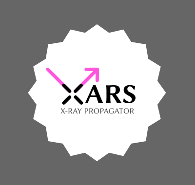

====================================
XARS X-ray Monte-carlo simulator
====================================

XARS simulates X-rays propagating through matter in user-defined geometries.

Features:

* Physical processes:

  * Photo-electric absorption
  * Compton scattering 
  * Fluorescent line emission (self-consistent with absorption above)

* Geometries:

  * Arbitrary user-defined geometries (included examples: toroid, sphere, disk)
  * Arbitrary geometries made from many spherical blobs/clumps (when combined with LightRayRider)
  * Arbitrary grid geometries from hydrodynamic simulations (when combined with LightRayRider)

The code-base is small (few hundred lines) and written in pure Python. New contributions are welcome.

How to cite XARS correctly
---------------------------

Please reference Buchner et al (in prep). 

Models
------------------

In Buchner et al. (in prep) we irradiated the following geometries,
and you can download xspec table models here.

* Sphere, Sphere with Bi-conical cut-out
* Clumpy model made from 100,000 spheres: Unified X-ray Clumpy model UXCLUMPY
* Radiative fountain, from a hydrodynamic grid simulation
* Warped Disk

Downloads, movies and more details on the `Models <doc/README.rst>`_ page.

Installation
------------------

XARS requires the following python modules:

   numpy scipy matplotlib h5py astropy progressbar-latest

You can install them with pip or conda as usual.

Once these are installed, you just run the scripts from this directory.

Usage
---------------------------------------------------

See the `Code Tutorial <doc/xars.rst>`_ to understand the code.

Questions and Problems
--------------------------------------------

If you have any questions or issues or questions, please check the `FAQ <doc/faq.rst>`_ or open a `Github issue <http://github.com/JohannesBuchner/xars/issues>`_. This helps other people google the same question.

License
-------------------

Free and Open Source software under AGPLv3. 

Contact me if you need a different license.

