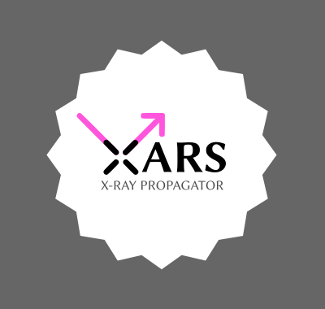

====================================
XARS X-ray Monte-carlo simulator
====================================

XARS simulates X-rays propagating through matter in user-defined geometries.

Features
---------

XARS is ~400 lines of pure Python code.

* Physical processes:

  * Photo-electric absorption
  * Compton scattering 
  * Fluorescent line emission (self-consistent with absorption above)

* Geometries:

  * Arbitrary user-defined geometries (included examples: toroid, sphere, disk)
  * Arbitrary geometries made from many spherical blobs/clumps (when combined with LightRayRider)
  * Arbitrary grid geometries from hydrodynamic simulations (when combined with LightRayRider)

New contributions are welcome.

How to cite XARS correctly
---------------------------

Please reference `Buchner et al (2019) <https://ui.adsabs.harvard.edu/abs/2019A%26A...629A..16B/abstract>`_. 

Models
------------------

Go to the `Models <doc/README.rst>`_ page.

In Buchner et al. (in prep) we irradiated the following geometries,
and you can download xspec table models here.

* Sphere, Sphere with Bi-conical cut-out
* Clumpy model made from 100,000 spheres: Unified X-ray Clumpy model UXCLUMPY, CAT3D-WIND
* Radiative fountain, from a hydrodynamic grid simulation
* Warped Disk
* ... and many others 

Downloads, movies and more details on the `Models <doc/README.rst>`_ page.

Installation
------------------

.. image:: https://img.shields.io/badge/docs-published-ok.svg
        :target: https://johannesbuchner.github.io/xars/
        :alt: Documentation Status
.. image:: https://github.com/JohannesBuchner/xars/actions/workflows/tests.yml/badge.svg
	:target: https://github.com/JohannesBuchner/xars/actions
.. image:: https://coveralls.io/repos/github/xars/LightRayRider/badge.svg?branch=master
	:target: https://coveralls.io/github/xars/LightRayRider?branch=master

XARS requires the following python modules:

   numpy scipy matplotlib h5py astropy progressbar2

You can install them with pip or conda as usual.

Once these are installed, you just run the scripts from this directory.

Usage
---------------------------------------------------

See the `Code Tutorial <doc/xars.rst>`_ to understand the code.

Questions and Problems
--------------------------------------------

If you have any questions or issues or questions, please check the `FAQ <doc/faq.rst>`_ or open a `Github issue <http://github.com/JohannesBuchner/xars/issues>`_. This helps other people google the same question.

License
-------------------

Free and Open Source software under AGPLv3. 

Contact me if you need a different license.

