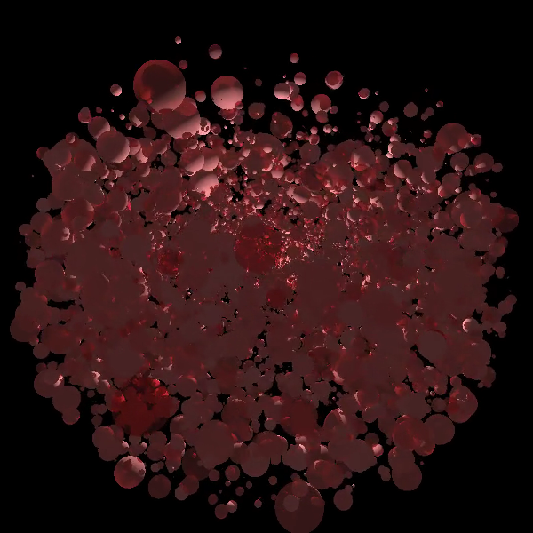
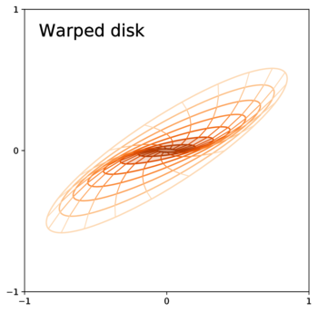
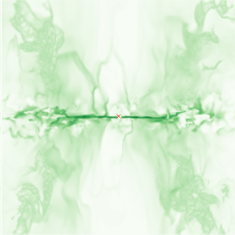
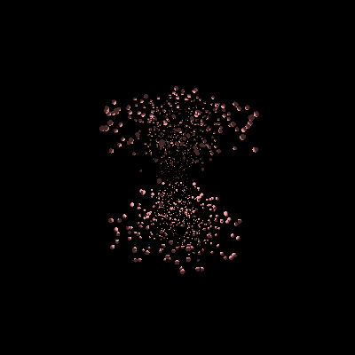
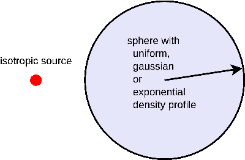
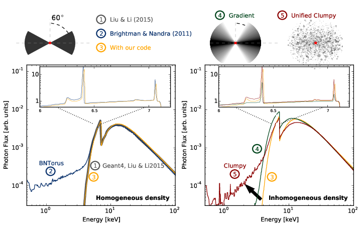
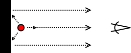
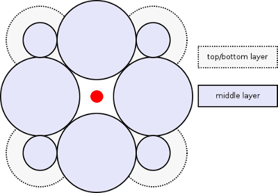

====================================
XARS X-ray Monte-carlo simulator
====================================

XARS simulates X-rays passing through matter in user-defined geometries.

Photo-electric absorption, compton scattering and fluorescent line processes are
modelled.

Usage
--------------------------
see `Code Documentation <xars.rst>`_

How to cite XARS correctly
---------------------------

Please reference `Buchner et al (2019), A&A, 629, A16, 14pp.
<https://ui.adsabs.harvard.edu/abs/2019A%26A...629A..16B/abstract>`_

Models
==================

In `Buchner+19 <https://ui.adsabs.harvard.edu/abs/2019A%26A...629A..16B/abstract>`_ we irradiated the following geometries,
and you can **download xspec table models here** for them. 
See the paper for description of the parameters and model assumptions.

**Each of these models also has a infrared model associated with it.**

UXCLUMPY
--------------------

The Unified X-ray Clumpy model (UXCLUMPY) features:

* Unification: Can produce unobscured, obscured and Compton-thick AGN in the right proportions.
* Eclipse events: The frequency and sizes of eclipses are reproduced by clumps on Keplerian orbits.
* X-ray spectra can fit observations well
* Compatible with CLUMPY infrared models

Here you can access:

* Geometry movies: https://vimeo.com/218031864 and 360 VR https://vimeo.com/253036759
* X-ray table model available at: `UXCLUMPY page <uxclumpy.rst>`_
* Infrared model available at: http://clumpy.org 
* More information: `Buchner et al. 2019 <https://ui.adsabs.harvard.edu/abs/2019A%26A...629A..16B/abstract>`_ (or send me an email)

Warped disk
--------------------

A simple warped disk geometry

* Geometry images: `Warped Disk page <warpeddisk.rst>`_
* X-ray table model available at: `Warped Disk page <warpeddisk.rst>`_
* Infrared model: see `Jud et al (2017) <http://cdsads.u-strasbg.fr/abs/2017MNRAS.465..248J>`_
* More information: `Buchner et al. (2021) <https://ui.adsabs.harvard.edu/abs/2021arXiv210608331B/abstract>`_

Radiative fountain (Wada 2012)
-------------------------------

* Geometry images: `Radiative fountain page <wada.rst>`_
* X-ray table model available at: `Radiative fountain page <wada.rst>`_
* Infrared model: `Radiative fountain page <wada.rst>`_
* More information: `Buchner et al. (2021) <https://ui.adsabs.harvard.edu/abs/2021arXiv210608331B/abstract>`_

CAT3D-WIND
---------------------------

* Infrared model: http://www.sungrazer.org/cat3d.html
* X-ray model: `CAT3D+WIND page <cat3d.rst>`_

Response of a single spherical blob
-------------------------------------

Reflection from a single sphere with

* Isotropic density
* Exponential density profile
* Gaussian density profile

Spectrum gives

* Angle-averaged reflection off a blob with uniform, gaussian or exponentialdensity profile.
* Parameters: Photon index, Energy cut-off, NH across the blob.
* Files: blob_uniform.fits, blob_gaussian.fits, blob_exponential.fits

Download:

* X-ray table model: https://doi.org/10.5281/zenodo.2235456
* Infrared model: https://en.wikipedia.org/wiki/Planck%27s_law

More information in the appendix of `Buchner et al. 2019 <https://ui.adsabs.harvard.edu/abs/2019A%26A...629A..16B/abstract>`_.

Wedge model
----------------

Download from: https://doi.org/10.5281/zenodo.2224650

 * Single wedge
 
   * Sphere with bi-conical cut-out (see also `BORUS02 <http://www.astro.caltech.edu/~mislavb/download/index.html>`_; Buchner et al., submitted)
   * Parameters: Photon index, Energy cut-off, Torus Opening angle, Viewing angle.
 
 * Gradient wedge model
 
   * Sphere with bi-conical cut-out, but gradually increasing density (see Buchner et al., submitted)
   * Parameters: Photon index, Energy cut-off, Torus Opening angle, Viewing angle.
   * Files: gradientwedge.fits gradientwedge-reflect.fits gradientwedge-reflect.fits

Disk
-----------------------

  

* Infinitely thick disk (similar to pexrav or pexmon, put self-consistently computed with XARS)
* Parameters: Photon index, Energy cut-off, viewing angle.
* Download link: https://doi.org/10.5281/zenodo.2224471
* Files: disk.fits diskreflect.fits disktransmit.fits
 
Presented in `Buchner et al. 2019<https://ui.adsabs.harvard.edu/abs/2019A%26A...629A..16B/abstract>`_.

Clumpybox3
----------------

* crate of spheres, just touching each other
* With many free parameters; useful for exploring clumpy geometries
* Geometry parameters: 

  * NH through the spheres (mean and variance across the spheres), 
  * filling: 1 if spheres are just touching (like in the illustration), otherwise radii are smaller by that factor.

* Parameters: Photon index, Energy cut-off, LOS NH, Inclination angle
* Download link: https://doi.org/10.5281/zenodo.2245188
* clumpy/clumpybox3.fits

Other torus models
--------------------

* a constant-density donut-shaped geometry, 60° opening angle: `MYTORUS <http://mytorus.com/mytorus-instructions.html>`_ and also `RXTorus <https://www.astro.unige.ch/reflex/xspec-models>`_.
* Another cone-cutout geometry `e-torus <https://heasarc.gsfc.nasa.gov/docs/xanadu/xspec/models/etorus.html>`_ (logNH=22-25 range only)
* Clumps in a donut outline `Ctorus <https://heasarc.gsfc.nasa.gov/xanadu/xspec/models/Ctorus.html>`_ (logNH=22-25, E=1-450keV only)

